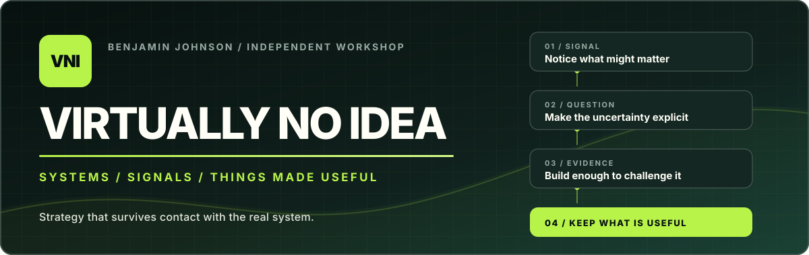

# VirtuallyNoIdea

  

  <strong>Benjamin Johnson's independent workshop and publishing imprint.</strong> 
  Emerging technology, made inspectable before it is made important.

  <a href="https://virtuallynoidea.com/">Website</a> ·
  <a href="https://virtuallynoidea.com/now">Now</a> ·
  <a href="https://virtuallynoidea.com/workbench">Workbench</a> ·
  <a href="https://virtuallynoidea.com/writing">Writing</a> ·
  <a href="https://virtuallynoidea.com/rss.xml">RSS</a> ·
  <a href="https://github.com/virtuallynoidea/noid">NOID</a>

> **The name is honest. The work is serious.**

VirtuallyNoIdea is where I play with emerging technology, test the difficult
questions and turn the useful parts into inspectable experiments, notes,
diagrams and repositories.

I work from early signal and proof of concept through product architecture,
trust, operating model and production readiness—staying close enough to the
technology to know when the strategy is wrong.

**Strategy should survive contact with the real system.**

---

## Four convictions I keep coming back to

<table>
  <tr>
    <td width="50%" valign="top">
      <h3>Capability is not permission.</h3>
      
An agent may be technically able to do something and still have no legitimate right to do it.

    </td>
    <td width="50%" valign="top">
      <h3>Autonomy is not accountability.</h3>
      
Freedom to choose a path does not transfer ownership of the consequence.

    </td>
  </tr>
  <tr>
    <td width="50%" valign="top">
      <h3>Token cost is not agent cost.</h3>
      
The real price includes people, platforms, integration, supervision, assurance, failure and change.

    </td>
    <td width="50%" valign="top">
      <h3>Learning is not uncontrolled self-modification.</h3>
      
Improvement should move through evidence, challenge, human approval and controlled promotion.

    </td>
  </tr>
</table>

---

## What has my attention

<table>
  <tr>
    <td width="50%" valign="top">
      <h3>01 · Governed digital work</h3>
      
Moving beyond impressive agents to work with an explicit outcome, identity, authority, evidence and accountable human control.

    </td>
    <td width="50%" valign="top">
      <h3>02 · Trust that is earned</h3>
      
Trust as something scoped to particular work, supported by evidence, continuously reassessed and withdrawn when the evidence changes.

    </td>
  </tr>
  <tr>
    <td width="50%" valign="top">
      <h3>03 · Improvement without drift</h3>
      
Systems that can observe, challenge and propose better ways of working without quietly rewriting their own authority or controls.

    </td>
    <td width="50%" valign="top">
      <h3>04 · The economics after tokens</h3>
      
The fully loaded cost of digital work: models and infrastructure, plus supervision, assurance, integration, failure and change.

    </td>
  </tr>
</table>

These are working questions, not claims that everything has been solved. The
useful part is making the model visible enough to test, challenge and improve.

---

## Latest public signals

Curated from public sources · checked 27 August 2026 · not a real-time feed

- **RELEASED · 26 AUG** — **[NOID public core is live](https://github.com/virtuallynoidea/noid).** Governed digital-work ideas now have an inspectable story, small contract, fictional team and deterministic demonstration.
- **CURRENT · UPDATED 24 AUG** — **[Keeping the agent in proportion](https://virtuallynoidea.com/now#simplest-useful-harness).** Can a clear outcome, small harness and good evidence outperform an elaborate agent team?
- **PUBLISHED · 19 AUG** — **[Are We Overcomplicating Enterprise Agentic AI?](https://virtuallynoidea.com/writing/are-we-overcomplicating-enterprise-agentic-ai)** Govern the work before building the workforce.
- **ACTIVE · PUBLIC WORKBENCH** — **[Agent-to-agent trust](https://virtuallynoidea.com/workbench#agent-to-agent-trust).** What should one agent require before relying on another's identity, authority or result?

Follow new essays and operating notes through the **[VNI RSS feed](https://virtuallynoidea.com/rss.xml)**.

---

## Public now: NOID

### [Beyond agents. Governed digital work.](https://github.com/virtuallynoidea/noid)

NOID is a human-readable design language for the hybrid workforce. It starts
where the agent demo ends: with the outcome, the participants, their authority,
the human-control relationship, the evidence, the cost boundary and the path
for governed improvement.

> **Your agent can act. Can your organisation explain why it was allowed to?**

The public repository includes:

- a deliberately small work-definition contract;
- a fictional two-worker team with an accountable human;
- inspectable worker, skill, tool, workflow, team and governance structures; and
- a deterministic demonstration producing a shared evidence receipt.

**[Explore NOID →](https://github.com/virtuallynoidea/noid)**

---

## Find your way in

- **[Now](https://virtuallynoidea.com/now) · `CURRENT`** — see what has my attention and what I am still trying to understand.
- **[Workbench](https://virtuallynoidea.com/workbench) · `ACTIVE`** — inspect the questions, working artefacts and evidence changing the position.
- **[Writing](https://virtuallynoidea.com/writing) + [RSS](https://virtuallynoidea.com/rss.xml) · `PUBLISHED`** — read the ideas that have earned a place in the public record.
- **[GitHub](https://github.com/virtuallynoidea) + [NOID](https://github.com/virtuallynoidea/noid) · `INSPECTABLE`** — read, run, challenge and improve the public artefacts.

The website carries the thinking. GitHub carries the inspectable proof.

---

## How I work

- **Evidence over theatre.** A screenshot, prototype, passing test and production outcome are different things.
- **Strategy stays close to implementation.** Making part of an idea real is often the fastest way to discover where the strategy is weak.
- **Human accountability stays visible.** AI may contribute, challenge and prepare work; consequential decisions still have a named human owner.
- **Public work is deliberate.** Artefacts are newly authored, bounded and reviewed without dragging protected work or history behind them.
- **Useful beats autonomous.** The right design uses the least agency that responsibly fits the work.

If something here sparks a useful disagreement, start there: challenge a
position, run the NOID demonstration or propose a clearer synthetic example.
For a real problem involving confidential or protected information,
**[email me](mailto:enquiries@virtuallynoidea.com)** instead of opening a public issue.

  Benjamin Johnson · Sydney, Australia · Personal / independent / views my own

